# Kubernetes Assignment

This project builds a small Kubernetes cluster on AWS EC2 and deploys an Nginx
web page with persistent storage. It uses kubeadm, not EKS. Terraform creates the
AWS resources and bootstraps the nodes. A separate script installs the cluster
add-ons, and Helm deploys the application.

The cluster has one control-plane node and two workers. This is an assignment
environment, not a highly available production cluster.

## What has been tested

The earlier deployment had three Ready nodes, healthy add-ons, and a working web
page. Cross-worker HTTP, cluster DNS, and data surviving pod recreation were
tested. These are results from the previous deployment, not a new test of the
current source. Add new results and screenshots in the section below when the
fresh deployment has been checked.

That earlier cluster was destroyed, and the module layout has since changed.
New application screenshots are included below. They do not establish that the
current source was deployed without manual repairs, or that remote-exec was used.
Those bootstrap checks still need to be recorded.

Public load-balancer access is also outstanding. AWS rejected NLB creation with
`OperationNotPermitted: This AWS account currently does not support creating load balancers`.
The local demo worked through port-forwarding, but that is not public access.

## Architecture

Open [docs/architecture.drawio](docs/architecture.drawio) in draw.io. It has two
pages: the cluster layout and the provisioning flow.

| Part | Implementation |
| --- | --- |
| AWS region | `ap-south-1` |
| VPC | `10.50.0.0/16` |
| Control plane | First public subnet, `10.50.0.0/24`, in `ap-south-1a` |
| Worker 1 | Second public subnet, `10.50.1.0/24`, in `ap-south-1b` |
| Worker 2 | Third public subnet, `10.50.2.0/24`, in `ap-south-1c` |
| API endpoint | Control-plane private IP `10.50.0.10:6443` |
| Pod network | Calico VXLAN, `192.168.0.0/16` |
| Service network | `10.96.0.0/12` |
| Application | One Nginx replica in namespace `web` |
| Application storage | Encrypted 2 GiB gp3 EBS volume |
| Intended public access | Internet-facing NLB, port 80 |
| Terraform state | S3 bucket `k8s-assignment-bucket` |

These values describe the current configuration. Region, subnet ranges, instance
types, versions, and other deployment settings can be changed in
`terraform/terraform.tfvars`. Update dependent values together; for example, AZs
must belong to the chosen region.

The control plane runs the API server, etcd, scheduler, and controller manager.
The workers run application pods. All three nodes run containerd and kubelet.
The public subnets have internet-gateway routes for package downloads, container
images, and AWS API calls.

The intended application path is:

```text
Browser -> NLB :80 -> worker NodePort -> Service -> Nginx pod
```

For the local demo, kubectl forwards a local port to the application through the
Kubernetes API. The API can be reached directly from an approved IP, or through
an SSH tunnel to the control plane.

## Folder layout

```text
k8s-assignment/
  terraform/
    modules/
      compute/          EC2, key pair, and node IAM
      networking/       VPC, subnets, routes, and security group
      kubernetes/       kubeadm templates and SSH provisioners
    main.tf             Calls the three modules
    variables.tf        Inputs and defaults
    locals.tf           Renders bootstrap scripts
    data.tf             Ubuntu AMI lookup
    provider.tf         Terraform/AWS constraints and provider settings
    backend.tf          S3 state settings
    outputs.tf          Cluster addresses and shared settings
    terraform.tfvars    Local deployment values; do not commit
  addons/
    cni/                Calico installation settings
    metallb/            AWS CCM settings; MetalLB is not installed
    csi/                EBS StorageClass
    install-addons.sh
  helm/webserver/
    Chart.yaml
    values.yaml
    templates/
  scripts/
    connect.sh
    settings.sh
    node-identities.sh
    recover.sh
  docs/architecture.drawio
  Makefile
```

The assignment layout allows CCM instead of MetalLB. The directory is named
`metallb` to match that layout, but its values are for AWS cloud-controller-manager.

All modules are local to this repository. No sibling module project is needed.

## How provisioning works

### Networking

The networking module creates the VPC, public subnets, internet gateway, public
route table, route-table associations, and one security group shared by the nodes.

The security group allows SSH and the API only from `allowed_admin_cidrs`.
Node-to-node traffic is allowed through a self-reference. NodePort traffic is
allowed from within the VPC. Outbound traffic is allowed for installation and
AWS service access.

### Compute and IAM

The compute module creates one control plane, the requested number of workers,
a key pair when requested, and a shared node IAM role and instance profile.

The control plane uses the first subnet. The first two workers use the second
and third subnets. Additional workers rotate through the subnet list.

Node root disks are encrypted and deleted when the instances terminate.
IMDSv2 is required, with a response hop limit of 2. The node role grants SSM,
EC2 discovery, load-balancer, and EBS permissions. These permissions are shared
by the nodes; a production system should review and narrow them.

### Kubernetes bootstrap

The common bootstrap script disables swap, enables the kernel modules and
forwarding settings needed by Kubernetes, installs containerd and AWS CLI, and
installs kubelet, kubeadm, and kubectl. Kubernetes packages are held at the
selected version. It also reads the EC2 instance ID and AZ through IMDSv2 to
set a provider ID such as `aws:///ap-south-1a/i-xxxxxxxx`.

The control plane runs `kubeadm init`, then writes these encrypted SSM parameters:

- `/<cluster-name>/join-command`: a join command with a short-lived token.
- `/<cluster-name>/kubeconfig`: the admin kubeconfig, stored as an Advanced parameter.

Each worker retrieves the join command and runs it. It retries while the
control plane is starting. You should not need to SSH into workers and join
them manually during a successful deployment. Retries are finite: a failed
bootstrap needs investigation rather than waiting indefinitely.

Two bootstrap methods are available:

| Method | What runs the script |
| --- | --- |
| `cloud-init` | EC2 runs the script from user data at first boot. This is the default. |
| `remote-exec` | Terraform connects over SSH, uploads the script, initializes the control plane, then bootstraps workers. |

For remote-exec, set `bootstrap_method = "remote-exec"` and provide
`provisioner_private_key_path`. SSH must be reachable from the machine running
Terraform. Logs go to `/var/log/cluster-bootstrap.log`.

Switching bootstrap methods changes user data and replaces the instances.
Changing package versions is not an in-place Kubernetes upgrade. Bootstrap
scripts are not automatically rerun on already initialized nodes.
Terraform's provisioner connections do not currently configure SSH host-key
verification; use this path only in the reviewed assignment environment.

### Add-ons

`terraform apply` does not install the add-ons or the application.
`make addons` runs `addons/install-addons.sh` in this order:

1. Check that the API is reachable and read the version settings from Terraform.
2. Install Calico CRDs and the matching operator, then apply the VXLAN configuration.
3. Fill missing node provider IDs only when an EC2 instance can be matched uniquely.
4. Install AWS CCM with host networking and bootstrap tolerations.
5. Wait for cloud initialization, restart kube-proxy, and wait for Calico.
6. Install EBS CSI, wait for its components, and create `ebs-gp3`.
7. Wait for all registered nodes to become Ready.

The installer includes fixes for issues seen during the earlier deployment:
Calico CRDs are installed before custom resources; Helm skips reinstalling those
CRDs; CCM can start before pod networking is ready; and kube-proxy is restarted
after CCM supplies node addresses. A guarded cleanup handles an empty,
incompatible Calico CRD left by a different operator version.

The script does not manually remove cloud-provider taints or reset nodes.
It also does not replace a missing worker bootstrap.

## The Helm application

The chart creates a Deployment, Service, PVC, and HTML ConfigMap. The default
image is `nginx:1.27-alpine`. Readiness and liveness checks request the web page.

The PVC is mounted at `/usr/share/nginx/html`. The ConfigMap supplies
`index.html`, showing the candidate name and architecture description.
Other files written to that directory use the persistent volume.

The StorageClass uses `WaitForFirstConsumer`: EBS is created only after the
scheduler selects a node for the pod. The volume is created in that node's AZ.
An existing EBS volume cannot attach to a worker in another AZ.

Keep one replica for the current storage design. Changing the replica count
alone does not make one EBS volume usable across workers in different AZs.
Multiple replicas need a storage design suited to that workload.

The chart contains an optional HPA template, disabled by default. HPA is a
bonus, not a required part of this assignment. Metrics Server is not installed
by the add-on script. Enabling HPA would need metrics and a review of storage
and scaling behavior.

## Before deploying

Install Terraform 1.10 or later, AWS CLI, kubectl, Helm, jq, make, and OpenSSH.
Configure AWS credentials with permission to create the resources used here.

Check your AWS identity:

```bash
aws sts get-caller-identity
```

Use an existing SSH key pair or create a dedicated one. Terraform reads the
public key; SSH and remote-exec use the matching private key. Never pass the
`.pub` file to SSH as its private key.

Run all commands below from the `k8s-assignment` directory.

### State backend

`terraform/backend.tf` points to:

```text
Bucket: k8s-assignment-bucket
Key:    k8s-assignment/terraform.tfstate
Region: ap-south-1
```

The bucket must already exist. This configuration does not create it.
Keep it private, enable versioning, and keep it outside the cluster's state so
cluster teardown does not delete it. State is encrypted and uses an S3 lockfile.

The Terraform identity needs bucket listing, read/write access to the state
object, and read/write/delete access to the lockfile. Do not put credentials
in `backend.tf`. Commit `.terraform.lock.hcl`, not state files or saved plans.

### Deployment settings

Edit your local `terraform/terraform.tfvars`. If creating it from scratch,
start with the following and replace the example admin CIDR:

```hcl
aws_region          = "ap-south-1"
cluster_name        = "harish-k8s-assignment"
vpc_cidr            = "10.50.0.0/16"
availability_zones  = ["ap-south-1a", "ap-south-1b", "ap-south-1c"]
public_subnet_cidrs = ["10.50.0.0/24", "10.50.1.0/24", "10.50.2.0/24"]
allowed_admin_cidrs = ["198.51.100.7/32"]

ssh_key_name        = "harish-k8s-assignment"
create_ssh_key      = true
ssh_public_key_path = "~/.ssh/id_ed25519.pub"

worker_count       = 2
kubernetes_version = "1.31"

# Select this for the assignment's Terraform provisioner bootstrap path.
bootstrap_method             = "remote-exec"
provisioner_private_key_path = "~/.ssh/id_ed25519"
```

The existing local tfvars file may use cloud-init through the default. Choose
the intended method explicitly before your fresh deployment.

Other supported inputs are listed in `terraform/variables.tf`:

| Settings | What they control |
| --- | --- |
| `ami_id`, `ami_lookup` | Explicit AMI or Canonical Ubuntu image selection |
| `control_plane_instance_type`, `worker_instance_type` | Node sizes |
| `root_volume_size`, `node_storage` | Root disk size, type, IOPS, throughput, and optional KMS key |
| `kubernetes_package_version` | Exact Debian package pin; default `1.31.14-1.1` |
| `bootstrap` | API port, reserved host address, kubeadm API version, token TTL, join retries, installer settings |
| `addon_versions` | Calico and AWS controller chart/image versions |
| `pod_cidr`, `service_cidr` | Kubernetes network ranges |
| `tags` | Additional AWS tags |

The AMI name filter selects Canonical Ubuntu 24.04 amd64 images. The bootstrap
currently assumes Ubuntu amd64. The AMI data lookup still runs even when
`ami_id` is supplied. Choose Kubernetes, kubeadm, Calico, and CCM versions
together; making them variable does not guarantee any version combination works.

## Deploy the cluster

```bash
make init
make validate
make plan
make apply
```

`make plan` saves `terraform/tfplan`. Review the changes before `make apply`,
which applies that saved plan.

In cloud-init mode, Terraform can finish before Kubernetes bootstrap finishes.
In remote-exec mode, Terraform waits for the provisioners. Workers can register
before add-ons are ready, so an initial NotReady state is expected.

## Connect to Kubernetes

Choose one of these methods.

### SSH tunnel

In one terminal:

```bash
make connect
```

Leave it open. In another terminal:

```bash
export KUBECONFIG="$PWD/terraform/kubeconfig"
kubectl get nodes
```

The script downloads the admin kubeconfig, configures the API as
`https://127.0.0.1:16443`, and opens an SSH tunnel to the private API address.
It still needs SSH access from your approved public IP. Verify the host
fingerprint when first connecting.

Set `SSH_PRIVATE_KEY` if using a different private key. Set `TUNNEL_PORT` if
16443 is already in use.

### Direct API access

This avoids the tunnel but requires port 6443 to be reachable from your approved
IP. Never allow SSH or API access from `0.0.0.0/0`.

```bash
make kubeconfig
export KUBECONFIG="$PWD/terraform/kubeconfig"

CLUSTER=$(kubectl config view --minify -o jsonpath='{.contexts[0].context.cluster}')
PRIVATE_IP=$(terraform -chdir=terraform console <<< 'local.control_plane_private_ip' | tr -d '"')
kubectl config set-cluster "$CLUSTER" --tls-server-name="$PRIVATE_IP"

kubectl get nodes
```

`make kubeconfig` reads Terraform's download command, fetches the SSM parameter,
changes the server to the current public IP, and sets file permissions to 600.
It does not create a cluster or tunnel. The TLS setting above checks the server
against its private IP certificate identity; it does not disable verification.

For manual download instead of `make kubeconfig`:

```bash
umask 077
REGION=$(terraform -chdir=terraform output -raw aws_region)
NAME=$(terraform -chdir=terraform output -raw cluster_name)

aws ssm get-parameter --region "$REGION" \
  --name "/$NAME/kubeconfig" --with-decryption \
  --query Parameter.Value --output text > terraform/kubeconfig

chmod 600 terraform/kubeconfig
export KUBECONFIG="$PWD/terraform/kubeconfig"

PUBLIC_IP=$(terraform -chdir=terraform output -raw control_plane_public_ip)
PRIVATE_IP=$(terraform -chdir=terraform console <<< 'local.control_plane_private_ip' | tr -d '"')
CLUSTER=$(kubectl config view --minify -o jsonpath='{.contexts[0].context.cluster}')

kubectl config set-cluster "$CLUSTER" \
  --server="https://$PUBLIC_IP:6443" --tls-server-name="$PRIVATE_IP"
kubectl get nodes
```

These direct-access examples use the default API port. Adjust it if you change
`bootstrap.api_port`. Downloading kubeconfig again overwrites the selected
endpoint. Treat this file as a secret: it grants cluster-admin access.

## Install add-ons and the application

With the API reachable:

```bash
make addons
kubectl get nodes -o wide
kubectl get tigerastatus
kubectl get pods -A
kubectl get storageclass ebs-gp3

make deploy
kubectl -n web get pods,pvc,svc
```

Expect three Ready nodes, healthy add-on pods, one ready application pod, and a
Bound PVC. If a worker is missing entirely, investigate its bootstrap before
assuming Calico will fix it.

To edit the web page or chart settings, update `helm/webserver/values.yaml`,
then run `make deploy` again.

### Open the web page

For local access:

```bash
make preview
```

Leave the port-forward running and open `http://localhost:8080`. Capture the
page showing the candidate name and architecture for your submission.

For public access, wait until the Service has a load-balancer hostname:

```bash
kubectl -n web get svc assignment-web-webserver -w
```

Stop watching after the hostname appears, then run:

```bash
LB=$(kubectl -n web get svc assignment-web-webserver \
  -o jsonpath='{.status.loadBalancer.ingress[0].hostname}')
if [ -n "$LB" ]; then
  curl --max-time 30 "http://$LB"
else
  echo "No load-balancer hostname yet. Check the Service events."
fi
```

If the Service stays pending, inspect it:

```bash
kubectl -n web describe svc assignment-web-webserver
```

An AWS `OperationNotPermitted` account restriction needs AWS Support or an
approved assignment exception. A quota showing 50 NLBs does not establish that
this account is permitted to create one. Do not claim local port-forwarding
satisfies the public-access requirement.

## Verify the deployment

### Nodes, controllers, and storage

```bash
kubectl get nodes -o wide
kubectl get pods -A
kubectl get tigerastatus
kubectl -n web get pods,pvc,svc
```

Look at the READY column as well as STATUS. A Running pod can still have an
unready container. The two workers normally show no role label; that does not
mean they failed to join.

### Cross-worker networking and DNS

These commands create two temporary pods on different Ready workers:

```bash
WORKERS=$(kubectl get nodes -o json | jq -r '
  .items[]
  | select(.metadata.labels["node-role.kubernetes.io/control-plane"] == null)
  | select(any(.status.conditions[]; .type == "Ready" and .status == "True"))
  | .metadata.name')
FIRST=$(printf '%s\n' "$WORKERS" | sed -n '1p')
SECOND=$(printf '%s\n' "$WORKERS" | sed -n '2p')
```

Check that both values are nonempty and different before continuing.

```bash
TEST_NS="network-check-$(date +%s)"
kubectl create namespace "$TEST_NS"

kubectl -n "$TEST_NS" run server --image=busybox:1.36 --restart=Never \
  --overrides="{\"spec\":{\"nodeName\":\"$FIRST\"}}" \
  --command -- sh -c 'mkdir -p /www; echo network-ok >/www/index.html; httpd -f -p 8080 -h /www'

kubectl -n "$TEST_NS" run client --image=busybox:1.36 --restart=Never \
  --overrides="{\"spec\":{\"nodeName\":\"$SECOND\"}}" \
  --command -- sleep 600

kubectl -n "$TEST_NS" wait --for=condition=Ready pods --all --timeout=3m
SERVER_IP=$(kubectl -n "$TEST_NS" get pod server -o jsonpath='{.status.podIP}')
kubectl -n "$TEST_NS" exec client -- wget -T 15 -qO- "http://$SERVER_IP:8080"
kubectl -n "$TEST_NS" exec client -- nslookup kubernetes.default.svc.cluster.local
kubectl -n "$TEST_NS" get pods -o wide
# Capture the networking screenshot before deleting the test namespace.
kubectl delete namespace "$TEST_NS"
```

The HTTP response should be `network-ok`, and DNS should resolve the Kubernetes
Service. Delete the temporary namespace even if a test fails.

### Persistent data

This test briefly interrupts the single-replica application. Run it only when
that downtime is acceptable.

```bash
POD=$(kubectl -n web get pods -l app.kubernetes.io/instance=assignment-web \
  -o jsonpath='{.items[0].metadata.name}')
printf 'Original pod: %s\n' "$POD"
kubectl -n web exec "$POD" -- sh -c 'echo storage-ok >/usr/share/nginx/html/storage-check.txt'
kubectl -n web delete pod "$POD"
kubectl -n web rollout status deployment/assignment-web-webserver --timeout=5m

POD=$(kubectl -n web get pods -l app.kubernetes.io/instance=assignment-web \
  -o jsonpath='{.items[0].metadata.name}')
printf 'Replacement pod: %s\n' "$POD"
kubectl -n web wait --for=condition=Ready "pod/$POD" --timeout=3m
kubectl -n web exec "$POD" -- cat /usr/share/nginx/html/storage-check.txt
kubectl -n web exec "$POD" -- rm /usr/share/nginx/html/storage-check.txt
```

The replacement pod should print `storage-ok`. This checks persistence after
pod recreation, not recovery from an AZ failure.

### Record evidence

Save the output of the checks above, the Service events, and `helm list -A`.
Keep a screenshot of the rendered page. Review evidence for sensitive data
before publishing it. Do not include kubeconfig, state, join tokens, or SSH keys.

The current project does not include the earlier `acceptance.sh` and
`evidence.sh` helpers. Use the manual checks in this section.

## Verification screenshots

These screenshots were supplied on 7 October 2026. The Helm screenshot shows a
deployment at 19:14 IST that day. They record the observed application and cluster
behavior; they do not establish which bootstrap method was used or prove that no
manual recovery was needed.

### 1. Cluster nodes

The node list shows one control plane and two workers, all Ready on Kubernetes
v1.31.14. The workers are `ip-10-50-1-121` and `ip-10-50-2-165`.

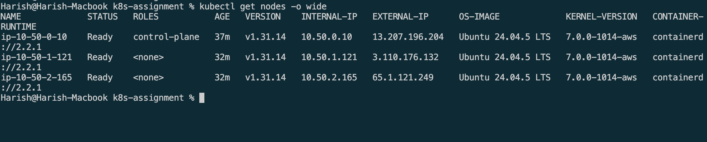

### 2. System and add-on health

The supplied pod list shows ready Kubernetes components, Calico, CoreDNS, AWS
CCM, EBS CSI, and the application. The Calico status shows its components
available and not degraded.

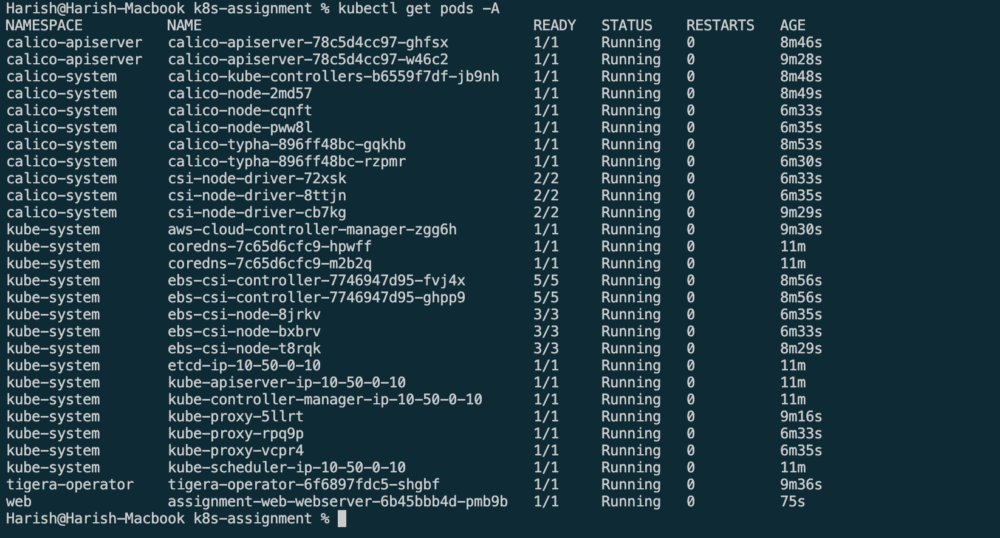

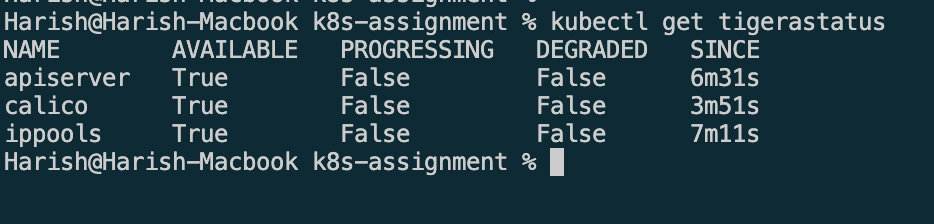

### 3. Application and persistent storage

The Helm release is deployed in namespace `web`. The Service exists, but its
public address is pending because AWS rejected load-balancer creation.

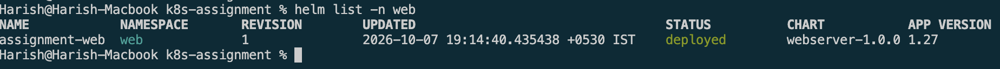

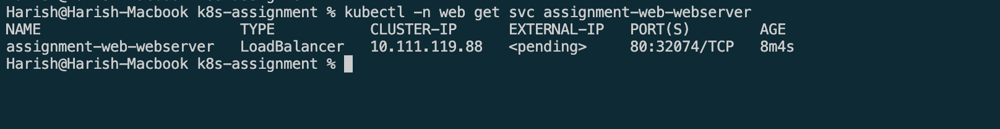

The `ebs-gp3` StorageClass uses the EBS CSI driver, waits for pod scheduling
before binding, and has the Delete reclaim policy.

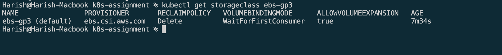

The application pod is ready, and its PVC is Bound with 2 GiB capacity,
ReadWriteOnce access, and the `ebs-gp3` StorageClass. The public address remains
pending; this does not affect the storage result.

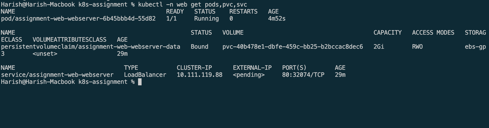

### 4. Rendered web page

The browser shows Harish Matur and the architecture description at
`127.0.0.1:8080`. This confirms local application access through port-forwarding,
not public NLB access.

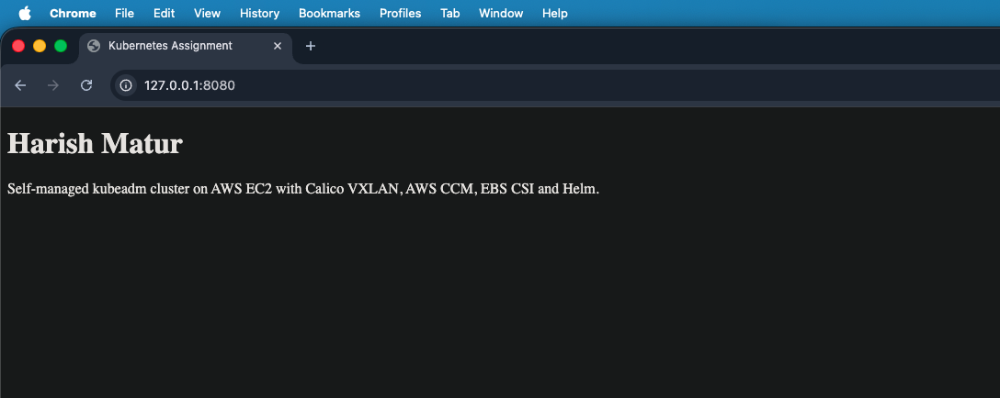

### 5. Cross-worker networking and DNS

The HTTP request returned `network-ok`, and cluster DNS resolved
`kubernetes.default.svc.cluster.local` to `10.96.0.1`.

The server runs on `ip-10-50-1-121`, while the client runs on
`ip-10-50-2-165`. Their different NODE values confirm that this request crossed
between the two workers.

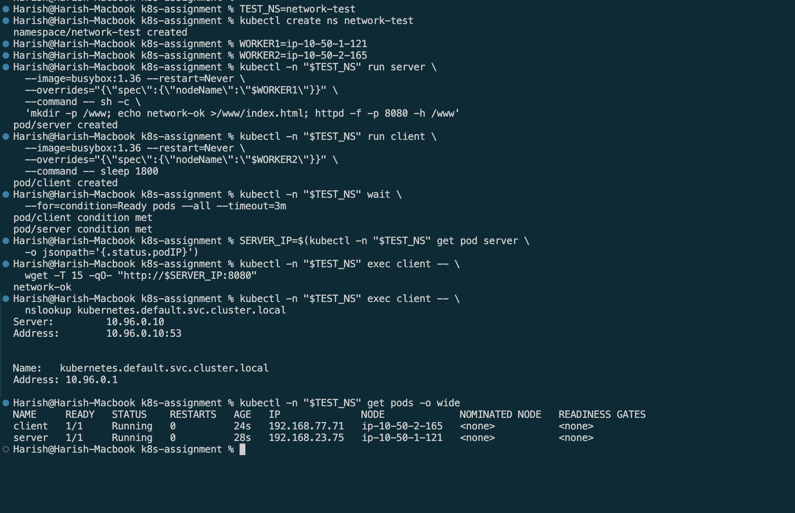

### 6. Data survives pod replacement

The test wrote `storage-ok` to the web directory, deleted the application pod,
waited for its replacement, and read the same value afterward. This demonstrates
data surviving pod replacement.

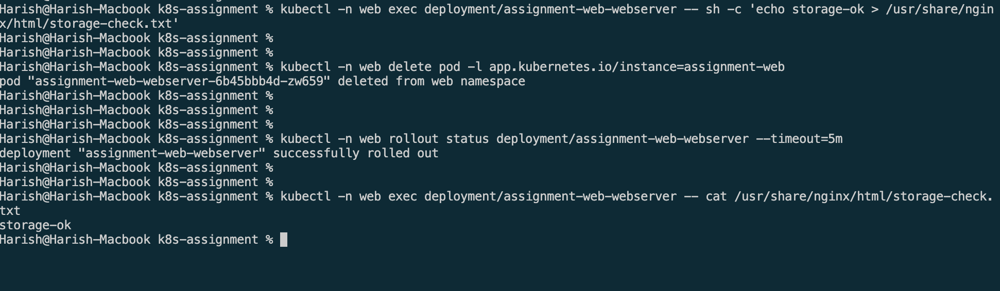

### 7. Public access restriction

The Service events show AWS returning `OperationNotPermitted` during
load-balancer creation. Public access remains blocked until AWS Support resolves
the restriction, or the reviewer approves an exception.

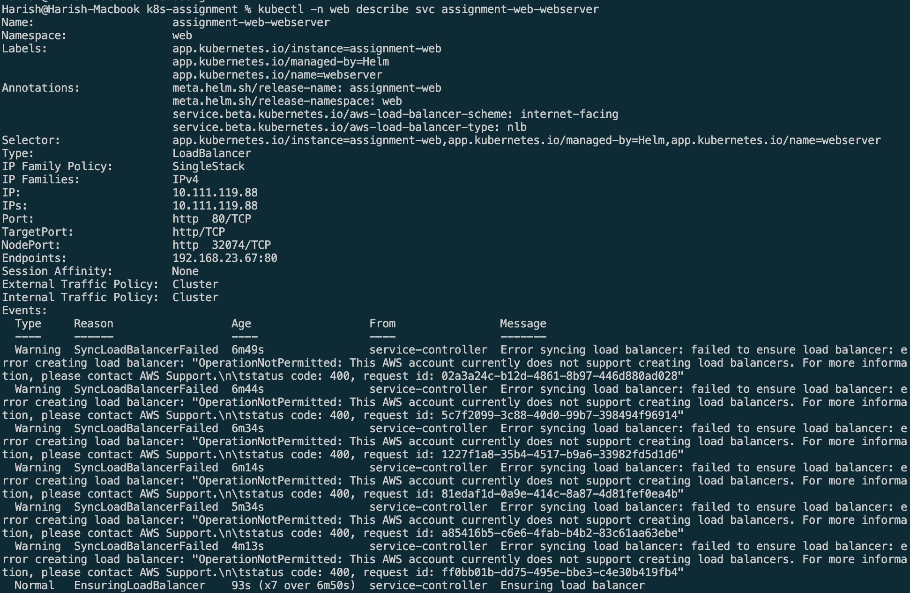

After approval, record the NLB hostname and a successful HTTP response or browser
capture at its public URL. Only then update the public-access result.

Review screenshots before publishing. Never include AWS credentials, private
keys, kubeconfig contents, join tokens, or Terraform state.

## Troubleshooting

| Symptom | What to check |
| --- | --- |
| kubectl tries localhost:8080 | Check KUBECONFIG. From the project root use `$PWD/terraform/kubeconfig`; from inside terraform use `$PWD/kubeconfig`. |
| Connection refused on 127.0.0.1:16443 | The SSH tunnel is not running, or failed to start. Check the connect terminal. |
| SSH times out | Check the current public IP, security-group admin CIDR, instance status, and network access. |
| SSH says invalid key format | Use the private key, not the .pub file. |
| SSM ParameterNotFound | Bootstrap has not published the parameter, or the account, region, or cluster name is wrong. |
| Only the control plane appears | Check worker cloud-init output or remote-exec logs and SSM join-command access. |
| Nodes are NotReady | Check Calico, CCM, node taints, and kubelet logs. |
| EBS CSI crashes | Check its container logs, IMDS connectivity, provider IDs, IAM permissions, and API connectivity. |
| NLB is pending | Read Service events; distinguish configuration errors from the AWS account restriction. |
| Terraform destroy says zero resources unexpectedly | Check the working directory, backend, and workspace. Do not apply into an empty state to recreate existing resources. |

On a cloud-init node, useful commands are:

```bash
sudo cloud-init status --long
sudo tail -n 100 /var/log/cloud-init-output.log
sudo journalctl -u kubelet -n 100 --no-pager
```

For remote-exec, inspect `/var/log/cluster-bootstrap.log` instead.

`make recover` is for a failed bootstrap, not a normal deployment step. It tries
to complete missing setup and publishes a fresh join command. It refuses a
partially initialized control plane rather than resetting it. Review the error
and the script before using recovery.

## Cleanup

Delete the application and its cloud-managed storage while the cluster, CCM,
and EBS CSI driver are still running. Deleting the PVC permanently deletes its
data when its PV uses the `Delete` reclaim policy. Back up anything you need first.

Before uninstalling, record the volume:

```bash
PV=$(kubectl -n web get pvc assignment-web-webserver-data \
  -o jsonpath='{.spec.volumeName}')
VOLUME_ID=$(kubectl get pv "$PV" -o jsonpath='{.spec.csi.volumeHandle}')
kubectl get pv "$PV"
echo "$VOLUME_ID"

helm uninstall assignment-web -n web
kubectl -n web delete pvc assignment-web-webserver-data --ignore-not-found
kubectl wait --for=delete "pv/$PV" --timeout=300s

aws ec2 describe-volumes --region ap-south-1 --volume-ids "$VOLUME_ID"
```

An AWS `InvalidVolume.NotFound` response confirms the volume is gone. If deletion
hangs, inspect CSI logs and the PV. Do not remove finalizers just to make the
object disappear. Also confirm any application load balancer has been removed.

Then destroy the infrastructure:

```bash
terraform -chdir=terraform plan -destroy
terraform -chdir=terraform destroy
terraform -chdir=terraform state list
```

The state list should be empty. Remove leftover bootstrap parameters if present:

```bash
aws ssm delete-parameters --region ap-south-1 \
  --names /harish-k8s-assignment/join-command /harish-k8s-assignment/kubeconfig
```

Use the actual region and cluster name if changed. Check AWS for leftover
assignment volumes, snapshots, and load balancers; these may incur charges.
Keep the S3 backend bucket and state history. Do not delete unrelated volumes.

`make destroy` only attempts the Helm uninstall and prints a reminder; it does
not destroy Terraform infrastructure.

## Supporting scripts

| File | Why it exists |
| --- | --- |
| `scripts/connect.sh` | Downloads kubeconfig and keeps an SSH tunnel open |
| `scripts/settings.sh` | Reads shared, non-secret Terraform settings |
| `scripts/node-identities.sh` | Fills missing provider IDs during add-on setup |
| `scripts/recover.sh` | Helps investigate and repair incomplete bootstrap |

## Limits and submission

There is one control plane, so losing it makes the API unavailable. Public
subnets and shared node IAM keep the assignment manageable, but production
would need a separate review of availability, private networking, workload
identity, backups, and permissions.

Before submitting, verify the current source with a fresh deployment, include
the draw.io diagram and test evidence, and document the public-access restriction
or its approved exception. Review the repository for secrets, publish the source,
and tag the reviewed final commit `v1.0`.

Do not describe the reorganized code or remote-exec mode as tested until that
test has actually passed. Share any necessary credentials through an approved
secrets manager, never in the README or an email.
